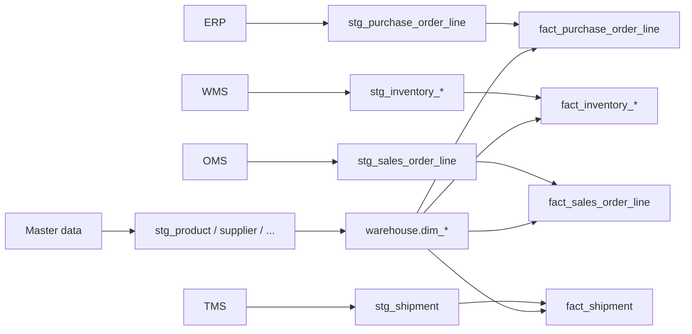

# Supply chain star schema (conceptual)

```mermaid
erDiagram
    DIM_DATE ||--o{ FACT_PURCHASE_ORDER_LINE : order_date
    DIM_DATE ||--o{ FACT_INVENTORY_SNAPSHOT : snapshot_date
    DIM_DATE ||--o{ FACT_INVENTORY_MOVEMENT : movement_date
    DIM_DATE ||--o{ FACT_SALES_ORDER_LINE : order_date
    DIM_DATE ||--o{ FACT_SHIPMENT : ship_date

    DIM_PRODUCT ||--o{ FACT_PURCHASE_ORDER_LINE : product
    DIM_PRODUCT ||--o{ FACT_INVENTORY_SNAPSHOT : product
    DIM_PRODUCT ||--o{ FACT_INVENTORY_MOVEMENT : product
    DIM_PRODUCT ||--o{ FACT_SALES_ORDER_LINE : product

    DIM_SUPPLIER ||--o{ FACT_PURCHASE_ORDER_LINE : supplier
    DIM_SUPPLIER ||--o{ FACT_INVENTORY_MOVEMENT : supplier

    DIM_CUSTOMER ||--o{ FACT_SALES_ORDER_LINE : customer
    DIM_CUSTOMER ||--o{ FACT_SHIPMENT : customer
    DIM_CUSTOMER ||--o{ FACT_INVENTORY_MOVEMENT : customer

    DIM_WAREHOUSE ||--o{ FACT_PURCHASE_ORDER_LINE : warehouse
    DIM_WAREHOUSE ||--o{ FACT_INVENTORY_SNAPSHOT : warehouse
    DIM_WAREHOUSE ||--o{ FACT_INVENTORY_MOVEMENT : warehouse
    DIM_WAREHOUSE ||--o{ FACT_SALES_ORDER_LINE : warehouse
    DIM_WAREHOUSE ||--o{ FACT_SHIPMENT : warehouse

    DIM_CARRIER ||--o{ FACT_SHIPMENT : carrier
    DIM_STATUS ||--o{ FACT_PURCHASE_ORDER_LINE : status
    DIM_STATUS ||--o{ FACT_SALES_ORDER_LINE : status
    DIM_STATUS ||--o{ FACT_SHIPMENT : status

    DIM_PRODUCT {
        int product_key PK
        string product_id
        string sku
    }
    DIM_SUPPLIER {
        int supplier_key PK
        string supplier_id
    }
    DIM_CUSTOMER {
        int customer_key PK
        string customer_id
    }
    DIM_WAREHOUSE {
        int warehouse_key PK
        string warehouse_id
    }
    DIM_CARRIER {
        int carrier_key PK
        string carrier_id
    }
    FACT_PURCHASE_ORDER_LINE {
        bigint po_line_key PK
        numeric ordered_qty
        numeric received_qty
        numeric ordered_amount
    }
    FACT_INVENTORY_SNAPSHOT {
        bigint inventory_snapshot_key PK
        numeric on_hand_qty
        numeric inventory_value
    }
    FACT_SALES_ORDER_LINE {
        bigint so_line_key PK
        numeric ordered_qty
        numeric shipped_qty
        numeric ordered_amount
    }
    FACT_SHIPMENT {
        bigint shipment_key PK
        numeric freight_cost
        boolean is_otif
    }
```

# Data lineage (high level)

```mermaid
flowchart LR
    ERP[ERP] --> STG_PO[stg_purchase_order_line]
    WMS[WMS] --> STG_INV[stg_inventory_*]
    OMS[OMS] --> STG_SO[stg_sales_order_line]
    TMS[TMS] --> STG_SH[stg_shipment]
    MDM[Master data] --> STG_DIM[stg_product / supplier / ...]

    STG_DIM --> DIMS[warehouse.dim_*]
    STG_PO --> F_PO[fact_purchase_order_line]
    STG_INV --> F_INV[fact_inventory_*]
    STG_SO --> F_SO[fact_sales_order_line]
    STG_SH --> F_SH[fact_shipment]
    DIMS --> F_PO
    DIMS --> F_INV
    DIMS --> F_SO
    DIMS --> F_SH
```
